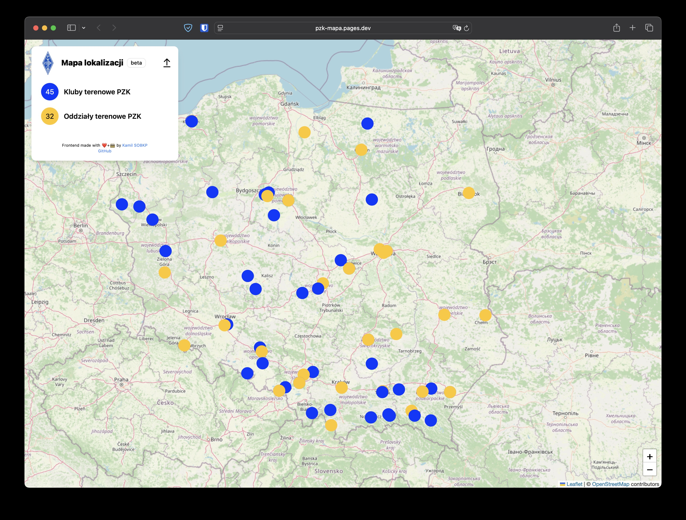

# PZK - mapa lokalizacji / location map



[https://dev.pzk.org.pl/mapa/](https://dev.pzk.org.pl/mapa/)

## Install:

```
pnpm i
```

## Run in dev mode

- Place `data.csv` file with location data in `public`, eg. from `https://dev.pzk.org.pl/mapa/data.csv`
- Then run `pnpm dev`

## Build
Run `pnpm build` then copy contents of `dist` folder to root of your hosting. Don't forget to place `data.csv` in the root!
